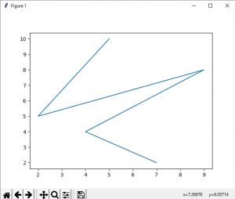
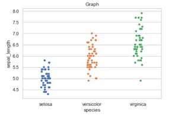
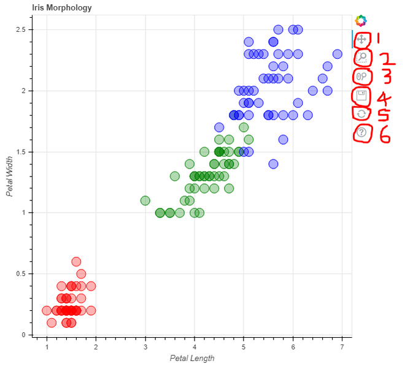

# Data Visualization 
Data Visualization is the graphic representation of data. It converts a huge dataset into small graphs, thus aiding in data analysis and predictions. It is an indispensable element of data science that makes complex data more understandable and accessible.

### What are the key differences between Matplotlib, Seaborn, and Bokeh libraries in terms of their features and use cases? Provide an example of a specific visualization that is more suitable for each library.

1. Matplotlib: It is a Python library used for plotting graphs with the help of other libraries like Numpy and Pandas. It is a powerful tool for visualizing data in Python. It is used for creating statical inferences and plotting 2D graphs of arrays. 

### Basic plots in Matplotlib :
Matplotlib comes with a wide variety of plots. Plots helps to understand trends, patterns, and to make correlations. such as: Line plot, Bar plot, Histogram, Scatter Plot.

### Example1: Line plot
```python
# importing matplotlib module
from matplotlib import pyplot as plt

# x-axis values
x = [5, 2, 9, 4, 7]

# Y-axis values
y = [10, 5, 8, 4, 2]

# Function to plot
plt.plot(x,y)

# function to show the plot
plt.show()
```


2. Seaborn: It is also a Python library used for plotting graphs with the help of Matplotlib, Pandas, and Numpy. It is built on the roof of Matplotlib and is considered as a superset of the Matplotlib library. It helps in visualizing univariate and bivariate data. It uses beautiful themes for decorating Matplotlib graphics. It acts as an important tool in picturing Linear Regression Models. It serves in making graphs of statical Time-Series data. It eliminates the overlapping of graphs and also aids in their beautification.

### Plotting categorical scatter plots with Seaborn
Stripplot, 
### Example2: Stripplot using inbuilt data-set given in seaborn 
```python
# Python program to illustrate
# Stripplot using inbuilt data-set
# given in seaborn

# importing the required module
import matplotlib.pyplot as plt
import seaborn as sns

# use to set style of background of plot
sns.set(style="whitegrid")

# loading data-set
iris = sns.load_dataset('iris')

# plotting strip plot with seaborn
# deciding the attributes of dataset on
# which plot should be made
ax = sns.stripplot(x='species', y='sepal_length', data=iris)

# giving title to the plot
plt.title('Graph')

# function to show plot
plt.show()
```


We can also draw this plot with matplotlib but the problem with matplotlib is its default parameters. The reason why Seaborn is so great with DataFrames is, for example, labels from DataFrames are automatically propagated to plots or other data structures as you see in the above figure column name species comes on the x-axis and column name stepal_length comes on the y-axis, that is not possible with matplotlib. We have to explicitly define the labels of the x-axis and y-axis.

3. Bokeh: is a Python library for creating interactive visualizations for modern web browsers. It helps you build beautiful graphics, ranging from simple plots to complex dashboards with streaming datasets. With Bokeh, you can create JavaScript-powered visualizations without writing any JavaScript yourself.

### Example3: Plotting a simple graph
```python
from bokeh.plotting import figure, output_file, show
from bokeh.sampledata.iris import flowers

# assign custom colors to represent each
# class of data in a dictionary format
colormap = {'setosa': 'red', 'versicolor': 'green',
			'virginica': 'blue'}

colors = [colormap[x] for x in flowers['species']]

# title for the graph
p = figure(title="Iris Morphology")

# label on x-axis
p.xaxis.axis_label = 'Petal Length'

# label on y-axis
p.yaxis.axis_label = 'Petal Width'

# plot each datapoint as a circle
# with custom attributes.
p.circle(flowers["petal_length"],
		flowers["petal_width"],
		color=colors,
		fill_alpha=0.3,
		size=15)

# you can save the output as an
# interactive html file
output_file("iris1.html", title="iris.py example")

# display the generated plot of graph
show(p)
```


The intended uses of matplotlib and Bokeh are quite different. Matplotlib creates static graphics that are useful for quick and simple visualizations, or for creating publication-quality images. Bokeh creates visualizations for display on the web (whether locally or embedded in a webpage) and most importantly, the visualizations are meant to be highly interactive. Matplotlib does not offer either of these features.


It's worth noting that these libraries are not mutually exclusive, and you can combine them based on your needs. For example, you can use Seaborn for statistical visualizations and Bokeh to add interactivity to those visualizations.

### In the Seaborn library, what are the main functions to create relational, categorical, and distribution plots? Briefly explain the purpose of each type of plot and provide an example use case.
1. Relational plots:

    * sns.scatterplot(): Creates a scatter plot to visualize the relationship between two continuous variables.
    * sns.lineplot(): Plots a line chart to show the trend or evolution of one or more continuous variables.
    * sns.relplot(): Creates a flexible relationship plot that can be used to visualize various types of relationships between variables.
Relational plots are used to explore the relationship between variables and identify patterns or trends in the data. They are helpful in understanding correlations, clusters, or any other form of association between variables.

Example use case: Visualizing the relationship between the age and income of individuals in a dataset to determine if there is any correlation between the two variables.

2. Categorical plots:

    * sns.barplot(): Creates a bar chart to display the mean or aggregated values of a continuous variable for different categories.
    * sns.boxplot(): Plots a box-and-whisker plot to represent the distribution of a continuous variable across different categories.
    * sns.countplot(): Displays the count of occurrences of each category in a categorical variable as a bar chart.
Categorical plots are useful for visualizing distributions, comparisons, or frequencies of categorical variables. They provide insights into the distribution of data within different categories.

Example use case: Comparing the average ratings of different products based on customer reviews using a bar plot.

3. Distribution plots:

    * sns.histplot(): Creates a histogram to visualize the distribution of a single continuous variable.
    * sns.kdeplot(): Plots a kernel density estimate to visualize the probability density function of a continuous variable.
    * sns.distplot(): Combines a histogram and a kernel density estimate to represent the distribution of a variable.
Distribution plots help in understanding the shape, central tendency, and spread of a continuous variable. They are useful for analyzing data distribution patterns and detecting outliers.

Example use case: Visualizing the distribution of exam scores among a group of students using a histogram.

These functions offer a variety of options and parameters to customize the appearance and behavior of the plots, allowing you to create informative and visually appealing visualizations for different types of data.

### Discuss the role of the Seaborn Cheat Sheet in a Python developer’s workflow. What are some key sections or elements featured in the cheat sheet that can help a developer quickly reference Seaborn functionalities?
1. Figure Aesthetics: This section explains how to control figure aesthetics in Seaborn, such as setting the style, adjusting labels, titles, limits, and properties of axes.

2. Plotting With Seaborn: This section demonstrates the basic steps to create plots with Seaborn, including preparing data, controlling figure aesthetics, and plotting with Seaborn functions.

3. Further Customizations: This section showcases additional customization options for Seaborn plots. It covers functions to remove spines, set labels, adjust tick labels, set axis labels, and more.

4. Show or Save Plot: Here, developers can find functions to display or save Seaborn plots. It includes examples of showing a plot using plt.show() and saving a plot as an image file using plt.savefig().

### *Resources:*
[Matplotlib Tutorial](https://github.com/rougier/matplotlib-tutorial)
[Seaborn Tutorial](https://seaborn.pydata.org/tutorial.html)
[Bokeh Tutorial](hhttps://hub.ovh2.mybinder.org/user/bokeh-bokeh-notebooks-nd3nw6a5/notebooks/tutorial/00%20-%20Introduction%20and%20Setup.ipynb)
[Seaborn Cheat Sheet](https://s3.amazonaws.com/assets.datacamp.com/blog_assets/Python_Seaborn_Cheat_Sheet.pdf)

## Things I want to know more about