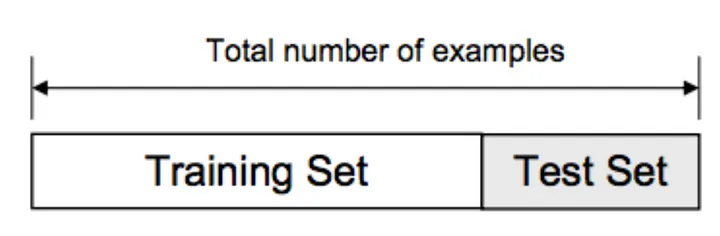

# Regression in Python
Data science and machine learning are driving image recognition, development of autonomous vehicles, decisions in the financial and energy sectors, advances in medicine, the rise of social networks, and more. Linear regression is an important part of this.

Regression analysis is one of the most important fields in statistics and machine learning. There are many regression methods available. Linear regression is one of them. 

Linear regression analysis is used to predict the value of a variable based on the value of another variable. The variable you want to predict is called the dependent variable. The variable you are using to predict the other variable's value is called the independent variable.


For example, you can observe several employees of some company and try to understand how their salaries depend on their features, such as experience, education level, role, city of employment, and so on.

### How To Run Linear Regressions In Python Scikit-learn
Scikit-learn is a Python package that simplifies the implementation of a wide range of Machine Learning (ML) methods for predictive data analysis.

Linear regression can be thought of as finding the straight line that best fits a set of scattered data points: 


You can then project that line to predict new data points. Linear regression is a fundamental ML algorithm due to its comparatively simple and core properties.

To run linear regressions in Python using scikit-learn, you need to follow these steps:

### Step 1: Import the necessary libraries

```python
import pandas as pd
from sklearn.linear_model import LinearRegression
from sklearn.model_selection import train_test_split
from sklearn.metrics import mean_squared_error, r2_score
```
### Step 2: Reading the Dataset
```python
df = pd.read_csv('bottle.csv')

df_binary = df[['column1', 'column2']] # Taking only the selected two attributes from the dataset

df_binary.columns = ['c1', 'c2'] # Renaming the columns for easier writing of the code
```
### Step 3: Exploring the Data Scatter
```python
sns.lmplot(x ="c1", y ="c2", data = df_binary, order = 2, ci = None)
```


### Step 4: Data Cleaning
```python
# Eliminating NaN or missing input numbers

df_binary.fillna(method ='ffill', inplace = True)
```

### Step 5: Split the data into training and testing sets



Splitting the dataset into train and test sets helps evaluate a machine learning model's performance on unseen data. The train set is used to train the model, while the test set is used to assess its ability to generalize and make predictions on new, unseen examples. This practice prevents overfitting and provides a realistic evaluation of the model's performance.


Split your data into training and testing sets using the *train_test_split* function.

```python
# Separating the data into independent and dependent variables

# Converting each dataframe into a numpy array 

# since each dataframe contains only one column

X = np.array(df_binary['c1']).reshape(-1, 1)

y = np.array(df_binary['c2']).reshape(-1, 1)

# Dropping any rows with Nan values

df_binary.dropna(inplace = True)

# Splitting the data into training and testing data
X_train, X_test, y_train, y_test = train_test_split(X, y, test_size=0.2, random_state=42)
```
### Step 6: Create and train the linear regression model
Create an instance of the LinearRegression class and train it using the training data.
```python
model = LinearRegression()
model.fit(X_train, y_train)
```

### Step 7: Make predictions
```python
y_pred = model.predict(X_test)

plt.scatter(X_test, y_test, color ='red')
plt.plot(X_test, y_pred, color ='blue')

plt.show()
```


By evaluating the model's performance on the test set, you can calculate various metrics such as accuracy, precision, recall, F1-score, or regression metrics like mean squared error (MSE) or R-squared. These metrics help you understand how well the model is performing and make comparisons between different models or parameter settings.
### Step 8: Evaluate the model
Assess the performance of the linear regression model by computing metrics such as mean squared error (MSE) (It measures the average squared difference between the predicted values and the actual values) and coefficient of determination (R-squared) (It measures how well the regression model fits the observed data).

```python
mse = mean_squared_error(y_test, y_pred)
r2 = r2_score(y_test, y_pred)
print("Mean squared error: ", mse)
print("R-squared: ", r2)
```
### *Resources:*

**Reading** 

[How to Run Linear Regression in Python](https://www.activestate.com/resources/quick-reads/how-to-run-linear-regressions-in-python-scikit-learn/)

**Additional Resources**

[Linear Regression in Python](https://realpython.com/linear-regression-in-python/)

**Videos**

[Introduction to Simple Linear Regressions](https://www.youtube.com/watch?v=KsVBBJRb9TE)

**Bookmark and Review**

[Train & Test Splits](https://towardsdatascience.com/train-test-split-and-cross-validation-in-python-80b61beca4b6)

[What is Linear Regression](https://www.statisticssolutions.com/free-resources/directory-of-statistical-analyses/what-is-linear-regression/)

## Things I want to know more about