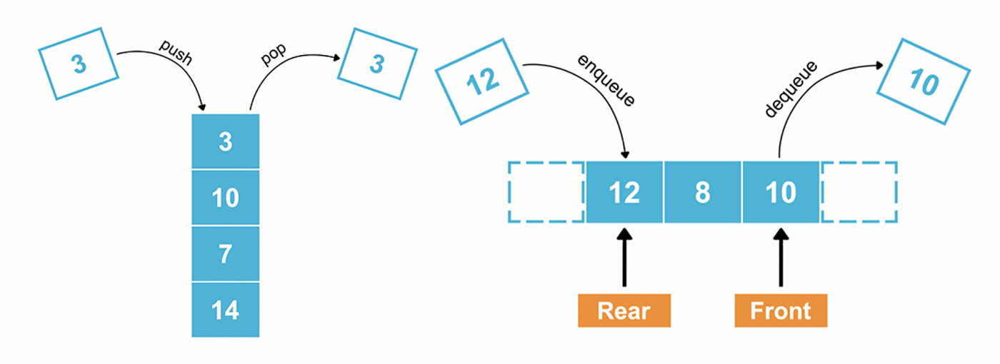
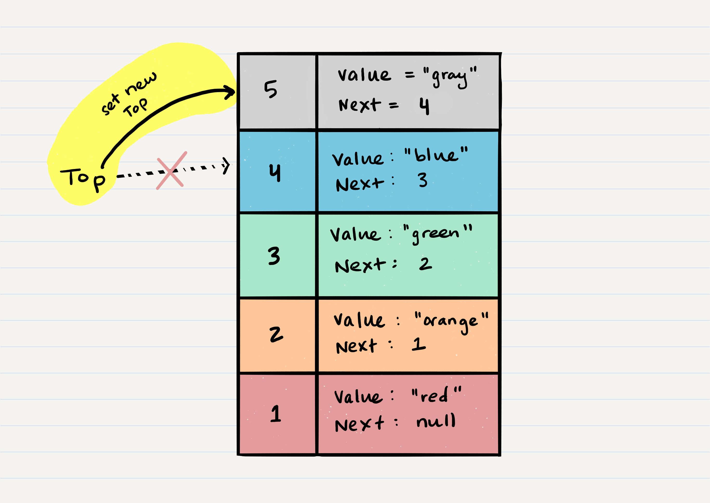
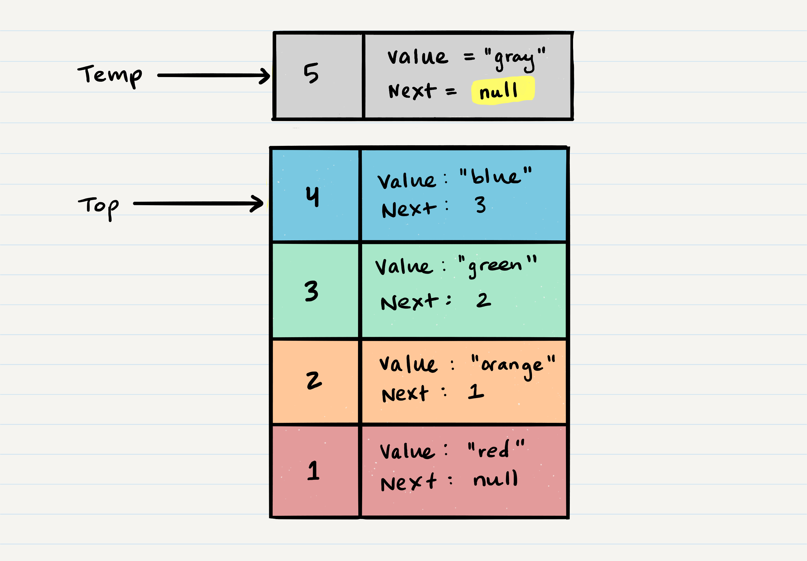
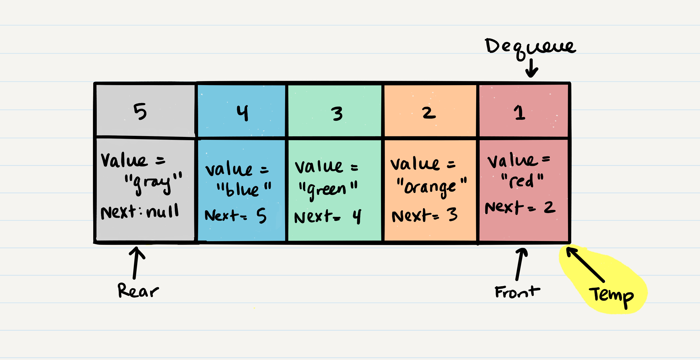

# Stacks and Queues

## What is a Stack & Queue
Both the stack and queue are the linear data structure, which means that the elements are stored sequentially and accessed in a single run
### Explain a detail in depth
| Basis for comparison | Stack | Queue |
| --- | --- | --- |
| Principle | It follows the principle LIFO (Last In- First Out), which implies that the element which is inserted last would be the first one to be deleted. | It follows the principle FIFO (First In -First Out), which implies that the element which is added first would be the first element to be removed from the list. |
| Structure | It has only one end from which both the insertion and deletion take place, and that end is known as a top. | It has two ends, i.e., front and rear end. The front end is used for the deletion while the rear end is used for the insertion. |
| Number of pointers used | It contains only one pointer known as a top pointer. The top pointer holds the address of the last inserted or the topmost element of the stack. | It contains two pointers front and rear pointer. The front pointer holds the address of the first element, whereas the rear pointer holds the address of the last element in a queue. |
| Operations performed | It performs two operations, push and pop. The push operation inserts the element in a list while the pop operation removes the element from the list. | It performs mainly two operations, enqueue and dequeue. The enqueue operation performs the insertion of the elements in a queue while the dequeue operation performs the deletion of the elements from the queue. |
| Examination of the empty condition | If top==-1, which means that the stack is empty. | If front== -1 or front = rear+1, which means that the queue is empty. |
| Examination of full condition | If top== max-1, this condition implies that the stack is full. | If rear==max-1, this condition implies that the stack is full. |
| Variants | It does not have any types. | It is of three types like priority queue, circular queue and double ended queue. |
| Implementation | It has a simpler implementation. | It has a comparatively complex implementation than a stack. |
| Visualization | A Stack is visualized as a vertical collection. | A Queue is visualized as a horizontal collection. |

 

## Track the details
## What is a Stack
A stack is a data structure that consists of `Nodes`. Each `Node` references the next Node in the stack, but does not reference its previous.

Common terminology for a stack is

1. Push - Nodes or items that are put into the stack are pushed
2. Pop - Nodes or items that are removed from the stack are popped. When you attempt to `pop` an empty stack an exception will be raised.
3. Top - This is the top of the stack.
4. Peek - When you `peek` you will view the value of the `top` Node in the stack. When you attempt to `peek` an empty stack an exception will be raised.
5. IsEmpty - returns true when stack is empty otherwise returns false.
Stacks follow these concepts:

### FILO
`F`irst `I`n `L`ast `O`ut

This means that the first item added in the stack will be the last item popped out of the stack.

### LIFO
`L`ast `I`n `F`irst `O`ut

This means that the last item added to the stack will be the first item popped out of the stack.

### Stack Visualization
Here’s an example of what a stack looks like. As you can see, the topmost item is denoted as the `top`. When you push something to the stack, it becomes the new `top`. When you pop something from the stack, you pop the current `top` and set the next `top` as top.next.

 

### Push O(1)
Pushing a Node onto a stack will always be an `O(1)` operation. This is because it takes the same amount of time no matter how many Nodes (`n`) you have in the stack.

When adding a Node, you `push` it into the stack by assigning it as the new top, with its `next` property equal to the original `top`.

Let’s walk through the steps:

1. First, you should have the Node that you want to add. Here is an example of a Node that we want to add to the stack. 
 

2. Next, you need to assign the next property of Node 5 to reference the same Node that top is referencing: Node 4
 

3. Technically at this point, your new Node is added to your stack, but there is no indication that it is the first Node in the stack. To make this happen, you have to re-assign our reference top to the newly added Node, Node 5.
 

4. Congratulations! You completed a successful push of Node 5 onto the stack.
Here is the pseudocode to push a value onto a stack:

```python
ALOGORITHM push(value)
// INPUT <-- value to add, wrapped in Node internally
// OUTPUT <-- none
   node = new Node(value)
   node.next <-- Top
   top <-- Node
```
### Pop O(1)
Popping a Node off a stack is the action of removing a Node from the top. When conducting a pop, the top Node will be re-assigned to the Node that lives below and the top Node is returned to the user.

Typically, you would check isEmpty before conducting a pop. This will ensure that an exception is not raised. Alternately, you can wrap the call in a try/catch block.

Let’s try and pop off Node 5 from the stack. Here is a visual of the current state of our stack:

 


1. The first step of removing Node 5 from the stack is to create a reference named temp that points to the same Node that top points to. 
 

2. Once you have created the new reference type, you now need to re-assign top to the value that the next property is referencing. In our visual, we can see that the next property is pointing to Node 4. We will re-assign top to be Node 4. 


3. We can now remove Node 5 safely without it affecting the rest of the stack. Before we do that though you may want to make sure that you clear out the next property in your current temp reference. This will ensure that no further references to Node 4 are floating around the heap. This will allow our garbage collector to cleanly and safely dispose of the Nodes correctly.


4. Finally, we return the value of the temp Node that was just popped off.

Here is the pseudocode for a pop
```python
ALGORITHM pop()
// INPUT <-- No input
// OUTPUT <-- value of top Node in stack
// EXCEPTION if stack is empty

   Node temp <-- top
   top <-- top.next
   temp.next <-- null
   return temp.value
```
### Peek O(1)
When conducting a peek, you will only be inspecting the top Node of the stack.

Typically, you would check isEmpty before conducting a peek. This will ensure that an exception is not raised. Alternately, you can wrap the call in a try/catch block.

Here is the pseudocode for a peek

```python
ALGORITHM peek()
// INPUT <-- none
// OUTPUT <-- value of top Node in stack
// EXCEPTION if stack is empty

   return top.value
```
We do not re-assign the next property when we peek because we want to keep the reference to the next Node in the stack. This will allow the top to stay the top until we decide to pop.

### IsEmpty O(1)
Here is the pseudocode for isEmpty

```python
ALGORITHM isEmpty()
// INPUT <-- none
// OUTPUT <-- boolean

return top = NULL
```

## What is a Queue
Common terminology for a queue is

1. Enqueue - Nodes or items that are added to the queue.
2. Dequeue - Nodes or items that are removed from the queue. If called when the queue is empty an exception will be raised.
3. Front - This is the front/first Node of the queue.
4. Rear - This is the rear/last Node of the queue.
5. Peek - When you peek you will view the value of the front Node in the queue. If called when the queue is empty an exception will be raised.
6. IsEmpty - returns true when queue is empty otherwise returns false.
Queues follow these concepts:

### FIFO
`F`irst `I`n `F`irst `O`ut

This means that the first item in the queue will be the first item out of the queue.

### LILO
`L`ast `I`n `L`ast `O`ut

This means that the last item in the queue will be the last item out of the queue.

### Queue Visualization
Here is what a Queue looks like:


### Enqueue O(1)
When you add an item to a queue, you use the enqueue action. This is done with an O(1) operation in time because it does not matter how many other items live in the queue (n); it takes the same amount of time to perform the operation.

Let’s walk through the process of adding a Node to a queue:


1. First, we should change the next property of Node 4 to point to the Node we are adding. In our case with the visual below, we will be re-assigning Node 4’s .next to Node 5. The only way we have access to Node 4 is through our reference rear. Following the rules of reference types, this means that we must change rear.next to Node 5. 


2. After we have set the next property, we can re-assign the rear reference to point to Node 5. By doing this, it allows us to keep a reference of where the rear is, and we can continue to enqueue Nodes into the queue as needed. 


3. Congratulations! You have just successfully added a Node to a queue by activating the enqueue action.

### Code
Here is the pseudocode for the enqueue method:
```python
ALGORITHM enqueue(value)
// INPUT <-- value to add to queue (will be wrapped in Node internally)
// OUTPUT <-- none
   node = new Node(value)
   rear.next <-- node
   rear <-- node
```
### Dequeue O(1)
When you remove an item from a queue, you use the dequeue action. This is done with an O(1) operation in time because it doesn’t matter how many other items are in the queue, you are always just removing the front Node of the queue.

Typically, you would check isEmpty before conducting a dequeue. This will ensure that an exception is not raised. Alternately, you can wrap the call in a try/catch block.

Let’s walk through the process of removing a Node from a queue.

1. The first thing you want to do is create a temporary reference type named temp and have it point to the same Node that front is pointing too. This means that temp will point to Node 1. 
2. Next, you want to re-assign front to the next value that the Node front is referencing. In our visual, this would be Node 2.


3. Now that we have moved front to the second Node in line, we can next re-assign the next property on the temp Node to null. We do this because we want to make sure that all the proper Nodes clear any unnecessary references for the garbage collector to come in later and clean up. 
4. Finally, we return the value of the temp Node that was just removed.
5. Congratulations! You have just successfully completed a dequeue action on a queue!
### Code
Here is the pseudocode for the dequeue method:
```python
ALGORITHM dequeue()
// INPUT <-- none
// OUTPUT <-- value of the removed Node
// EXCEPTION if queue is empty

   Node temp <-- front
   front <-- front.next
   temp.next <-- null

   return temp.value
```
### Peek O(1)
When conducting a peek, you will only be inspecting the front Node of the queue.

Typically, you want to check isEmpty before conducting a peek. This will ensure that an exception is not raised. Alternately, you can wrap the call in a try/catch block.

### Code
Here is the pseudocode for a peek
```python
ALGORITHM peek()
// INPUT <-- none
// OUTPUT <-- value of the front Node in Queue
// EXCEPTION if Queue is empty

   return front.value
```
We do not re-assign the next property when we peek because we want to keep the reference to the next Node in the queue. This will allow the front to stay in the front until we decide to dequeue

### IsEmpty O(1)
Here is the pseudocode for isEmpty
```python
ALGORITHM isEmpty()
// INPUT <-- none
// OUTPUT <-- boolean

return front = NULL
```
## Things I want to know more about