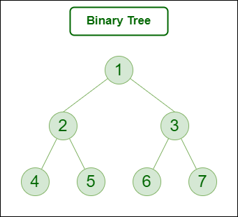

### What is a Tree Data Structure in Python?
A Tree is a non-linear Data structure in which data items are connected using references in a hierarchical manner. Each Tree consists of a root node from which we can access each element of the tree. Starting from the root node, each node contains zero or more nodes connected to it as children. A simple binary tree can be depicted as seen in the following figure.


### Why Tree is considered a non-linear data structure?
The data in a tree are not stored in a sequential manner i.e, they are not stored linearly. Instead, they are arranged on multiple levels or we can say it is a hierarchical structure. For this reason, the tree is considered to be a non-linear data structure.

### Important Terms
Following are the important terms with respect to tree.

* Path − Path refers to the sequence of nodes along the edges of a tree.

* Root − The node at the top of the tree is called root. There is only one root per tree and one path from the root node to any node.

* Parent − Any node except the root node has one edge upward to a node called parent.

* Child − The node below a given node connected by its edge downward is called its child node.

* Leaf − The node which does not have any child node is called the leaf node.

* Subtree − Subtree represents the descendants of a node.

* Visiting − Visiting refers to checking the value of a node when control is on the node.

* Traversing − Traversing means passing through nodes in a specific order.

* Levels − Level of a node represents the generation of a node. If the root node is at level 0, then its next child node is at level 1, its grandchild is at level 2, and so on.

* Keys − Key represents a value of a node based on which a search operation is to be carried out for a node.


### Types of Trees
Types of Trees in Data Structure based on the number of children:

* Binary Trees

* Ternary Tree

* N-ary Tree (Generic Tree)

1. Binary Trees
A binary Tree is defined as a Tree data structure with at most 2 children. Since each element in a binary tree can have only 2 children, we typically name them the left and right child.

Example:
Consider the tree below. Since each node of this tree has only 2 children, it can be said that this tree is a Binary Tree



2. Ternary Tree
A Ternary Tree is a tree data structure in which each node has at most three child nodes, usually distinguished as “left”, “mid” and “right”.

Example:
Consider the tree below. Since each node of this tree has only 3 children, it can be said that this tree is a Ternary Tree


3. N-ary Tree (Generic Tree)
Generic trees are a collection of nodes where each node is a data structure that consists of records and a list of references to its children(duplicate references are not allowed). Unlike the linked list, each node stores the address of multiple nodes. 
Every node stores the addresses of its children and the very first node’s address will be stored in a separate pointer called root.

 1. Many children at every node.
 2. The number of nodes for each node is not known in advance.

Example:


Here's an example implementation in python:
```python
class TreeNode:
    def __init__(self, value):
        self.value = value
        self.children = []

    def add_child(self, child):
        self.children.append(child)

    def remove_child(self, child):
        if child in self.children:
            self.children.remove(child)

    def print_tree(self, level=0):
        indent = "  " * level
        print(indent + self.value)
        for child in self.children:
            child.print_tree(level + 1)

# Create nodes
root = TreeNode("A")
node_b = TreeNode("B")
node_c = TreeNode("C")
node_d = TreeNode("D")

# Connect nodes
root.add_child(node_b)
root.add_child(node_c)
node_c.add_child(node_d)

# Print the tree before removal
root.print_tree()

# Remove a child
root.remove_child(node_c)

# Print the tree after removal
root.print_tree()

#output
#A
#  B
```
## Things I want to know more about